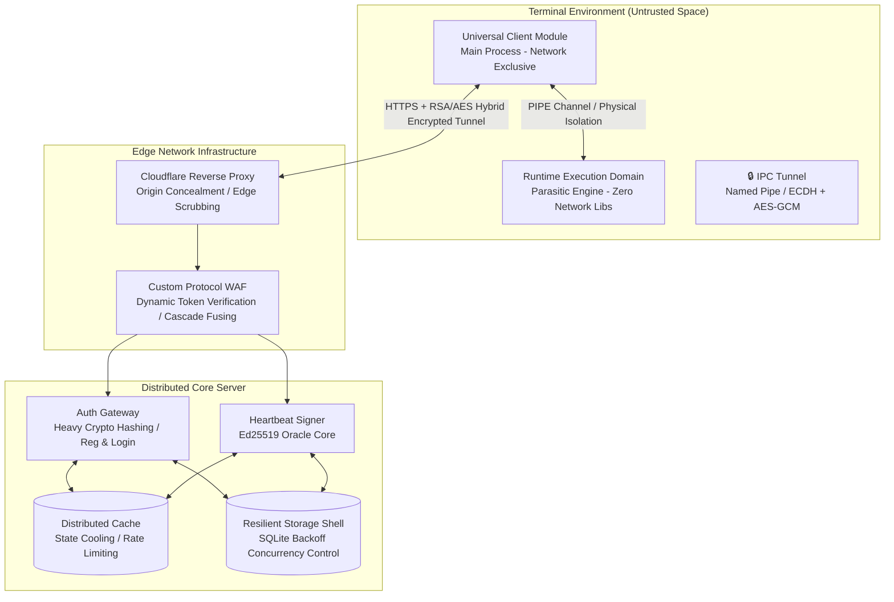
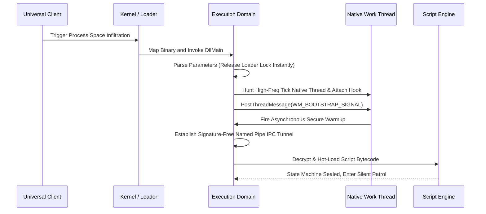

> 📂 **Open-Source Core Repository**: [github.com/philipsljh/core-adversary-shield](https://github.com/philipsljh/core-adversary-shield)  
> *(Note: The production-ready C++ execution engine, kernel-level IPC pipe, and architecture contracts elucidated in this whitepaper are fully available for source auditing in this repository.)*

# 🚀 Core Security Client (CSC) — Architecture Specification & Technical Whitepaper

> **Document Version**: v1.0.0  
> **Release Date**: 2026-05  
> **Classification**: Public (Fully Desensitized Archive)  
> **Target Audience**: Lead Security Engineers, Systems Architects, Technical Directors

---

## 📌 Executive Summary

This document elucidates a **distributed security defense framework featuring edge-collaborative verification, high availability, and rigid isolation between client and server components**. Designed specifically for high-adversarial hostile environments, the core objective of this system is to construct an end-to-end zero-trust secure communication chain from the cloud-native edge gateway down to the in-process runtime execution engine within untrusted endpoint environments.

The architecture abandons monolithic security configurations and bifurcates into three core logical domains:
* **Universal Client Module** — Runs in the endpoint user-space as a security signaling proxy layer. It handles credential management, establishes hybrid encrypted communication tunnels, and orchestrates interactions with external edge infrastructure.
* **Runtime Environment Validation Domain (Execution Engine / Injection Module)** — Dynamically embedded within the target process, provisioning import-table-free symbol resolution, native thread lifecycle hijacking, delayed randomized memory poisoning, and runtime code compliance auditing.
* **Zero-Trust Edge Gateway** — Deployed across elastic cloud instances to anchor high-frequency, high-risk business endpoints. It integrates adaptive Proof-of-Work (PoW) computational rate-limiting, Ed25519 oracle signature issuance, and a resilient, lighter-weight storage engine fortified with exponential backoff algorithms.

### 🛡️ Core Design Philosophy

| Principle | Physical Implementation | Expected Security Boundary |
| :--- | :--- | :--- |
| **Physical Isolation Topology** | The in-process execution engine is strictly decoupled from network communication libraries; inter-process interaction is bound to a kernel-level, signature-free **Named Pipe IPC** channel. | The execution engine exhibits **absolute zero network footprints** in its binary, physically severing the attacker's path for in-process network packet sniffing. |
| **Full Statelessness** | All network cryptographic operations and session key derivations are executed instantaneously within the **Stack Memory Frame** of a single function invocation. | No class member variables or global contexts retain session keys long-term, neutralizing memory dumps from extracting active session credentials. |
| **Cryptography-Driven Oracle** | The client maintains zero core state machines locally; its lifecycle persistence relies entirely on the cloud-native asymmetric signature **Oracle Mechanism**. | Attackers cannot bypass verification by patching local branch instructions (e.g., JZ/JMP) in memory, ensuring absolute cloud-enforced sovereignty. |
| **Zero-Residual Erasure** | Sensitive keys utilize `VirtualLock` to prevent memory page swapping, augmented with random XOR masking, and are forcibly overwritten immediately post-operation. | Resists dynamic memory forensics and cold-boot attacks, fully satisfying **Memory Residual Carcass Auditing (MRCA)** standards. |
| **Adversarial Chain Extension** | Abandons the pursuit of single-point absolute defense; leverages multi-process, multi-layer onion network cuts to systematically escalate the adversary's overall exploit costs. | Transforms the protocol reverse-engineering and cracking costs into the attacker's own **physical hardware computational costs**. |

---

## 🌐 High-Level Topology

### 1. Distributed Data Flow



### 2. Architectural Contracts

* **Compile-Time Severance**: The runtime execution domain is explicitly stripped of all network communication libraries (e.g., Winsock, HTTP Client) during compilation. Disassembling the module's binary yields absolutely no network-facing import tables or control flows.
* **Specification-Patterned Interfacing**: The main client process abstracts all communication behaviors into a generic execution engine (`Protocol Gateway`). Individual API endpoints are dynamically plugged in as pure data-structure specification classes, allowing communication stack upgrades with zero modifications to the core business layer.

---

## 🛠️ Subsystem Breakdown

### I. Core Control Flow & Process Parasitism

#### 1.1 Deferred Execution & Thread Hunting

To evade the **Loader Lock deadlock hell** triggered when executing heavy initializations inside the Dynamic Link Library entry point (`DllMain`), the framework strictly prohibits asynchronous thread creation or GUI pooling upon attachment. It utilizes the **Deferred Execution Pattern**:

1. **Environment Attachment**: The main process triggers injection via system-level primitives; the entry point performs nominal parameter resolution and instantly relinquishes the loader lock.
2. **Native Thread Hunting**: The injection module scans internal process routines to capture an active, healthy native work thread driven by a high-frequency clock interrupt (Tick).
3. **Control Flow Hijacking**: Utilizing a lightweight hook, the security self-test state machine is hooked into the lifecycle of this native thread.
4. **Asynchronous Message Pump Dispatching**: The initialization routine is dispatched to the target thread's message pump via `PostThreadMessage`, spinning up the execution engine completely outside the boundaries of Loader Lock.



#### 1.2 Zero-Footprint Memory Erasure & MRCA

For account credentials, ephemeral symmetric keys, and decrypted script bytecode dispatched to the terminal, the system dictates an uncompromising lifecycle destruction chain:

> **Zero-Footprint Erasure Pattern**:
> Any temporary cipher buffer allocated on the Heap must be overwritten physically via the operating system's native `SecureZeroMemory` (or `explicit_bzero`, which possesses strong side-effects that prohibit compiler optimization dead-store removal) within exactly $0.000$ milliseconds post-operation.

To guarantee absolute compliance, the system integrates a background **Memory Residual Carcass Auditing (MRCA)** routine:
Exactly $3$ seconds after credential release, an asynchronous auditing thread scans active memory pages. If any signature matching the session keys or plaintext credentials is caught lingering in the memory desert, the framework assumes a sanitization failure and fires a global hard-kill self-destruction event.

---

## II. Runtime Environment Validation & Anti-Reverse Engineering (REV)

### 2.1 Dual-Buffer Architecture of SecureKeyContext

Sensitive cryptographic keys **never reside in plaintext format** within terminal memory long-term. The system implements a dual-buffered container utilizing a randomized entropy mask and XOR obfuscation pinned inside the stack:

* **Shadow Buffer**: Obfuscated Cipher (Original ^ Mask).
* **Entropy Mask**: Generated at runtime via OS-level RNG.
* **VirtualLock**: Locks pages to physical memory, preventing swap file leaks.

### 2.2 Delayed Memory Poisoning

Upon detecting active debugging attachments (e.g., x64dbg/IDA Pro) or unauthorized modifications to memory signatures, the framework **rejects the naive strategy of firing an immediate crash**.

Instead, it deploys **Delayed Memory Poisoning**:

* **Silent Stamping**: The detection routines flip a thread-safe atomic `Dirty` state vector while letting the control flow pass unimpeded.
* **Adaptive Retry Decay**: Over the subsequent $3 \sim 8$ randomized heartbeat intervals, the client silently mutates **a single byte (flipping an arbitrary 1 Bit)** of an internal cipher or Nonce block.
* **Adversary Disorientation**: To the attacker, the exploit attempt succeeds initially, only to morph into random network timeouts, cipher mismatches, or token rejections minutes later. Because the causal chain is physically stretched across time and space, the adversary loses the deterministic feedback loops required to trace the defense vectors.

---

## III. Zero-Trust Edge Gateway & Application-Layer Anti-Bot

### 3.1 Hybrid Encryption Protocol

Every payload transaction routed between the client gateway and the distributed backend architecture implements rigid **Perfect Forward Secrecy heuristics**:

1. Cryptographically secure RNG spawns an ephemeral 32-Byte symmetric SessionKey.
2. Encrypts payload via AES-256-GCM -> Extracts [IV(12)] + [Ciphertext] + [Auth_Tag(16)].
3. Encrypts the SessionKey via hardcoded RSA-2048 Cloud Public Key -> Yields 256-Byte encrypted block.
4. Packet Assembly: [RSA_Cipher(256)] + [IV(12)] + [AES_Cipher] + [Tag(16)].
5. Standardized Base64 encoding transloads payload to the Edge Gateway.
6. Cloud Go Server decrypts it with Private Key, and **reuses the SessionKey** to encrypt response. Finally, both ends zero memory post-operation.

### 3.2 Onion Middleware Pipeline

When adversaries thoroughly reverse-engineer client protocols and deploy automated bots to bombard heavy, transaction-expensive endpoints (such as registration, login, and billing), the cloud-native Go router activates a rigid defensive slicing pipeline:

* **Layer 0: Edge Anti-Downgrade Middleware**: Dynamic timestamp tolerance filtering (Locked within a ±120s physical line to crush replay vectors).
* **Layer 1: Adaptive Proof-of-Work Cut (VerifyPoW Middleware)**: Forces incoming headers to present a valid SHA-256 leading-zero Answer bound to a 20s TTL ticket.
* **Layer 2: Cascading Flow Fusing Cut (Rate Limiter)**: Enforces token-bucket boundaries (Violations activate a 5m -> 30m -> 24h step-ladder physical infrastructure ban).

### 3.3 Resilient Storage Shell via Adaptive Jitter Backoff

To neutralize severe write conflicts and `database is locked (SQLITE_BUSY)` crashes when highly concurrent network streams bombard a lighter-weight single-thread storage file, the engine wraps transactions in a resilient distributed scheduling shell:

* **Deadlock Loop Pruning**: Injects the `_txlock=immediate` parameter at connection initialization, completely preempting the optimization zone where shared read locks attempt to escalate to exclusive write locks.
* **Adaptive Jitter Backoff**: Upon encountering lock contentions, the system rejects rigid, fixed delay loops. Instead, it queries `crypto/rand` to calculate an **adaptive distributed randomized jitter latency ($20\text{ms} \sim 80\text{ms}$)** before re-polling. High-concurrency streams are physically diffused across a nanosecond timeline, maximizing storage performance under extreme loads.

---

## 🎯 AI-Native Engineering Paradigm

A defining engineering achievement of this project is its organic **anti-AI-pollution gene** coded into the codebase from day one.

The architecture completely deprecates the legacy, monolithic anti-pattern of feeding bloated, tightly-coupled code context into AI prompts, which inevitably sparks LLM hallucinations and technical-debt explosions. Instead, it operates on a **Contract-First, Dark-Sandbox Paradigm**:

* **Rigid Type Assertion & Error Monads**: The entire application layer bans implicit control-flow hijacking via `throw/catch`. All business and network routines wrap returns into an explicit, type-safe generic monad `ResultT<T>`, pre-sorting errors into four immutable categories (A/B/C/D).
* **Sandboxed Modular Contracts**: Because every security atom (e.g., the crypto tag evaluator or decryption router) is designed to be completely stateless with zero residual data footprints, these files can be plugged into isolated AI dialogue sandboxes (e.g., Cline, Gemini) without feeding any global system state.

**Engineering Value**:
The AI is completely insulated from global dependency noise, ensuring **100% precise, hallucination-free code synthesis**. When adapting to newly discovered polymorphic reverse threats, the architect does not waste time debugging or refactoring legacy dependencies. Instead, the AI is instructed to synthesize a pristine, stateless replacement middleware inside an isolated sandbox in under a second, executing seamless plug-and-play swaps and achieving the engineering milestone of **crushing over-engineering through instant high-frequency refactoring**.

```


