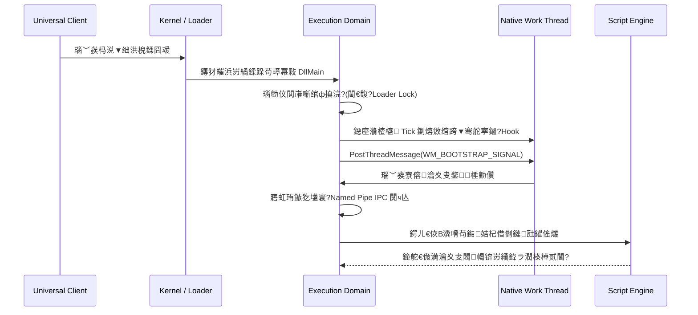

---

# 馃殌 Core Security Client (CSC) 鈥?Architecture Specification & Technical Whitepaper

> **Document Version**: v1.0.0
> **Release Date**: 2026-05
> **Classification**: Public (Fully Desensitized Archive)
> **Target Audience**: Lead Security Engineers, Systems Architects, Technical Directors

---

## 馃搶 Executive Summary锛堟墽琛屾憳瑕侊級

鏈枃妗ｉ槓杩颁簡涓€涓?*鍏峰杈圭紭鍗忓悓鏍￠獙銆侀珮鍙敤銆佸己闅旂鐨勫鎴风/鏈嶅姟绔仈鍔ㄥ垎甯冨紡瀹夊叏闃插尽妗嗘灦**銆傝绯荤粺涓撲负楂樺鎶楋紙High-Adversarial锛夋晫瀵圭幆澧冭璁★紝鍏舵牳蹇冪洰鏍囨槸鍦ㄤ笉鍙俊鐨勭粓绔繍琛岀幆澧冧腑锛屽缓绔嬩竴鏉′粠浜戠杈圭紭缃戝叧鍒拌繘绋嬪唴鎵ц寮曟搸鐨?*绔埌绔浂淇′换瀹夊叏閾捐矾**銆?

绯荤粺鎽掑純浜嗕紶缁熺殑鍗曚綋瀹夊叏璁捐锛岀敱涓夊ぇ鏍稿績閫昏緫鍩熸瀯鎴愶細

* **Universal Client Module锛堥€氱敤瀹㈡埛绔富鎺ц繘绋嬶級** 鈥?杩愯浜庣粓绔敤鎴锋€佺┖闂达紝浣滀负瀹夊叏淇′护浠ｇ悊灞傦紝璐熻矗浠ｇ悊韬唤鍑瘉绠＄悊銆佹贩鍚堝姞瀵嗛€氫俊闅ч亾寤虹珛銆佷互鍙婂閮ㄨ竟缂樼綉缁滅殑浜や簰璋冨害銆?
* **Runtime Environment Validation Domain锛堣繍琛屾椂鐜楠岃瘉鍩?/ 娉ㄥ叆妯″潡锛?* 鈥?鍔ㄦ€佸祵鍏ヨ嚦鐩爣鎵ц杩涚▼鍐呴儴锛屾彁渚涙棤瀵煎叆琛ㄧ鍙疯В鏋愩€佸绾跨▼鐜鍔寔銆佸弽璋冭瘯闅忔満寤惰繜鎶曟瘨銆佷互鍙婁唬鐮佹墽琛屾€佸悎瑙勬€ц嚜妫€銆?
* **Zero-Trust Edge Gateway锛堥浂淇′换杈圭紭鍒嗗竷寮忕綉鍏筹級** 鈥?閮ㄧ讲浜庡脊鎬т簯绔紝鎵胯浇楂橀楂樺嵄涓氬姟鎺ュ彛銆傞泦鎴愯嚜閫傚簲宸ヤ綔閲忚瘉鏄庯紙PoW锛夌畻鍔涢槻鍒枫€丒d25519 绁炶皶绛惧悕绛惧彂銆佷互鍙婂叿澶囨寚鏁伴€€閬挎姉姝婚攣鑳藉姏鐨勮交閲忕骇瀛樺偍寮曟搸銆?

### 馃洝锔?鏍稿績璁捐鍝插

| 鏍稿績鍘熷垯 | 鐗╃悊灞傚疄鐜版柟寮?| 棰勬湡鐨勫畨鍏ㄨ竟鐣?|
| --- | --- | --- |
| **鐗╃悊闅旂鎷撴墤** | 杩涚▼鍐呮墽琛屽紩鎿庝笌缃戠粶閫氫俊缁勪欢褰诲簳鍓ョ锛屽弻绔€氳繃鍐呮牳绾ф棤鐗瑰緛鍛藉悕绠￠亾锛圢amed Pipe锛夐殧绂汇€?| 鎵ц寮曟搸鍦ㄤ簩杩涘埗灞傞潰**缁濆闆剁綉缁滆冻杩?*锛岀墿鐞嗗垏鏂粦瀹㈤拡瀵硅繘绋嬬殑缃戠粶鎶撳寘璺緞銆?|
| **鍏ㄦ爤闆剁姸鎬佸寲** | 鎵€鏈夌綉缁滃姞瑙ｅ瘑銆佷細璇濆瘑閽ユ淳鐢熸搷浣滃潎鍦ㄥ崟娆″嚱鏁拌皟鐢ㄧ殑**鏍堝唴瀛橈紙Stack锛?*涓灛鏃跺畬鎴愩€?| 浠讳綍绫绘垚鍛樺彉閲忎笌鍏ㄥ眬涓婁笅鏂囦笉闀挎湡鎸佹湁浼氳瘽瀵嗛挜锛屾潨缁濋潤鎬佸唴瀛?Dump 瀵艰嚧鐨勫嚟璇佹硠闇层€?|
| **瀵嗙爜瀛﹂┍鍔ㄥ喅绛?* | 瀹㈡埛绔湰鍦颁笉杩愯浠讳綍鏍稿績鐘舵€佹満锛屾湰鍦扮敓鍛藉懆鏈熺殑缁寸郴瀹屽叏渚濊禆浜戠闈炲绉扮鍚嶇殑**绁炶皶鏈哄埗**銆?| 榛戝鏃犳硶閫氳繃淇敼鏈湴鍐呭瓨璺宠浆鎸囦护锛堝 JZ/JMP锛夌粫杩囬獙璇侊紝瀹炵幇浜戠缁濆鎵ф硶銆?|
| **鍐呭瓨闆舵畫鐣欐摝闄?* | 鏁忔劅瀵嗛挜閲囩敤 `VirtualLock` 闃叉鍐呭瓨椤典氦鎹紝閰嶅悎闅忔満鐔垫帺鐮侊紙XOR Mask锛夋贩娣嗭紝涓氬姟缁撴潫绔嬪嵆寮哄埗瑕嗗啓銆?| 鎶靛尽鍔ㄦ€佸唴瀛樺彇璇佷笌鍐峰惎鍔ㄦ敾鍑伙紝閫氳繃涓ユ牸鐨?*鍐呭瓨娈嬬暀瀹¤锛圡RCA锛?*娴嬭瘯銆?|
| **鍥犳灉閾鹃槻寰℃媺闀?* | 鏀惧純瀵绘壘鍗曠偣缁濆闃插尽锛岄€氳繃澶氳繘绋嬨€佸缃戠粶灞傚垏闈㈢殑鍗忓悓鎷︽埅锛屾彁楂樻敾鍑昏€呯殑缁煎悎瀵规姉鎴愭湰銆?| 灏嗛粦瀹㈢殑鍗忚閫嗗悜涓庣垎鐮存垚鏈紝寮鸿杞珌涓哄叾鑷韩鐨?*鐗╃悊纭欢绠楀姏鎴愭湰**銆?|

---

## 馃寪 High-Level Topology锛堥珮闃舵嫇鎵戯級

### 1. 绯荤粺鍒嗗竷寮忔暟鎹祦

```mermaid
graph TB
    subgraph "Terminal Environment (涓嶅彲淇＄粓绔┖闂?"
        EXE[Universal Client Module<br/>涓绘帶杩涚▼ - 鐙崰缃戠粶缁勪欢]
        DLL[Runtime Execution Domain<br/>瀵勭敓鎵ц寮曟搸 - 闆剁綉缁滅粍浠禲
        PIPE[馃敀 IPC Tunnel<br/>Named Pipe / ECDH + AES-GCM]
    end

    subgraph "Edge Network Infrastructure (杈圭紭缃戠粶灞?"
        CDN[Cloudflare Reverse Proxy<br/>婧愮珯闅愯韩 / 鏅鸿兘杈圭紭娓呮礂]
        WAF[Custom Protocol WAF<br/>鍔ㄦ€佹殫鍙锋牎楠?/ 棰戠巼绾ц仈鐔旀柇]
    end

    subgraph "Distributed Core Server (鍒嗗竷寮忓悗绔兢)"
        AUTH[Auth Gateway<br/>楂樺己鍝堝笇璁＄畻 / 娉ㄥ唽鐧诲綍]
        HEARTBEAT[Heartbeat Signer<br/>Ed25519 绁炶皶绛惧彂鏍稿績]
        REDIS[(Distributed Cache<br/>鐘舵€佸喎鍗?/ 绾ц仈闄愭祦)]
        SQLITE[(Resilient Storage Shell<br/>SQLite 鎸囨暟閫€閬挎姉姝婚攣)]
    end

    EXE <-->|HTTPS + RSA/AES 娣峰悎鍔犲瘑闅ч亾| CDN
    CDN --> WAF
    WAF --> AUTH
    WAF --> HEARTBEAT
    AUTH <--> REDIS
    HEARTBEAT <--> REDIS
    AUTH <--> SQLITE
    HEARTBEAT <--> SQLITE
    EXE <-->|PIPE 閫氶亾 / 鐗╃悊闅旂| DLL

```

### 2. 鍏抽敭瑙ｈ€﹀绾﹁鏄?

* **缂栬瘧鏈熺墿鐞嗘柇浜?*锛氭敞鍏ユā鍧楋紙Execution Domain锛夊湪缂栬瘧鏈熻鍓ョ浜嗘墍鏈夌殑缃戠粶閫氫俊搴擄紙濡?Winsock銆丠TTP Client锛夈€傚嵆浣块粦瀹㈠畬鏁村弽姹囩紪娉ㄥ叆妯″潡鐨勪簩杩涘埗鏂囦欢锛屼篃鏃犳硶鎵惧埌浠讳綍鍙互鐢ㄤ簬缃戠粶鍙戝寘鐨勫鍏ヨ〃鎴栨帶鍒舵祦銆?
* **閫氫俊灞傛爣鍑嗘彃妲藉寲**锛氫富鎺ц繘绋嬪皢鎵€鏈夐€氫俊琛屼负鎶借薄涓虹粺涓€鐨勬硾鍨嬫墽琛屽紩鎿庯紙Protocol Gateway锛夛紝鍏蜂綋鎺ュ彛浣滀负绾暟鎹粨鏋勮鑼冪被锛圫pecification Pattern锛夊姩鎬佹彃鍏ャ€傞€氫俊搴曞骇鍗囩骇锛堝鍗忚鍙樻洿鎴栨洿鎹㈤€氫俊缁勪欢锛夋椂锛屼笟鍔￠€昏緫灞傝揪鎴愭棤鐥涢浂淇敼銆?

---

## 馃洜锔?Subsystem Breakdown锛堝瓙绯荤粺娣卞害鎷嗚В锛?

### 涓€銆?鏍稿績鎺у埗娴佷笌杩涚▼瀵勭敓鏋舵瀯

#### 1.1 寤惰繜鎵ц妯″紡涓庡師鐢熺嚎绋嬬寧鏉€锛圱hread Hunting锛?

涓轰簡瑙勯伩鎿嶄綔绯荤粺鍦ㄥ姩鎬侀摼鎺ュ簱鍏ュ彛鐐癸紙`DllMain`锛夊紩鍙戠殑 **Loader Lock锛堝姞杞藉櫒閿侊級姝婚攣鍦扮嫳**锛岀郴缁熶弗绂佸湪鍏ュ彛鐐规墽琛屼换浣曢噸閲忕骇鍒濆鍖栥€傜郴缁熼噰鐢?**Deferred Execution Pattern锛堝欢杩熷鍐虫ā寮忥級**锛?

1. **鐜鍒囧叆**锛氫富鎺ц繘绋嬮€氳繃绯荤粺搴曞眰璋冪敤瑙﹀彂娉ㄥ叆锛屾敞鍏ユā鍧楀叆鍙ｇ偣浠呮墽琛屾瀬杞婚噺鍙傛暟瑙ｆ瀽锛岄殢鍗抽€€鍑哄紩瀵奸攣銆?
2. **鍘熺敓绾跨▼鐚庢潃**锛氭敞鍏ユā鍧楀湪鐩爣杩涚▼鍐呴儴灞曞紑宸￠€伙紝鎹曡幏涓€涓師鐢熻嚜甯﹂珮棰戞椂閽熶腑鏂紙Tick锛夌殑鍋ュ悍宸ヤ綔绾跨▼銆?
3. **鎺у埗娴佹寕鎺?*锛氬埄鐢ㄥ畾鍒跺寲鐨勮交閲忕骇 Hook锛屽皢瀹夊叏鑷鐘舵€佹満鎸傛帴鑷宠鍘熺敓绾跨▼鐨勭敓鍛藉懆鏈熶腑銆?
4. **寮傛娑堟伅娉甸┍鍔?*锛氶€氳繃 `PostThreadMessage` 灏嗗垵濮嬪寲閫昏緫鎶涘悜鐩爣绾跨▼鐨勬秷鎭车锛屽湪瀹屽叏鑴辩 Loader Lock 鐨勫畨鍏ㄤ笂涓嬫枃鐜涓媺璧锋墽琛屽紩鎿庛€?



#### 1.2 闆惰冻杩瑰唴瀛樻摝闄や笌娈嬬暀瀹¤锛圡RCA锛?

瀵逛簬涓嬪彂鑷崇粓绔殑璐︽埛鍑瘉銆佸姞瀵嗕复鏃跺瘑閽ュ強瑙ｅ瘑鍚庣殑鑴氭湰瀛楄妭鐮侊紝绯荤粺鍒跺畾浜嗕弗鑻涚殑鐢熷懡鍛ㄦ湡娑堜骸閾捐矾锛?

> **Zero-Footprint Erasure Pattern (闆惰冻杩规摝闄ゆā寮?**:
> 鍑℃槸鍦ㄥ爢锛圚eap锛変笂鐢宠鐨勪复鏃跺瘑鏂囩紦鍐插尯锛屽湪涓氬姟鐢熷懡鍛ㄦ湡缁撴潫鍚庣殑 $0.000$ 姣鍐咃紝蹇呴』閫氳繃鎿嶄綔绯荤粺搴曞眰鐨?`SecureZeroMemory`锛堟垨鍏锋湁寮哄壇浣滅敤銆佺姝㈢紪璇戝櫒浼樺寲鐨?`explicit_bzero`锛夎繘琛岀墿鐞嗚鍐欍€?

涓轰簡楠岃瘉鎿﹂櫎閾捐矾鐨勭粷瀵瑰畬鏁存€э紝绯荤粺鍐呯疆浜?**Memory Residual Carcass Auditing锛圡RCA锛屽唴瀛樻畫鐣欏璁℃祴璇曪級**锛?
鍦ㄥ嚟璇佷笅鍙戦噴鏀?$3$ 绉掑悗锛屽紓姝ョ洃娴嬬嚎绋嬩細瀵瑰叏杩涚▼鍐呭瓨椤靛睍寮€娣卞害鎵弿銆備竴鏃﹀湪鍐呭瓨鑽掓紶涓尮閰嶅埌浠讳綍灞炰簬浼氳瘽瀵嗛挜鎴栨槑鏂囧嚟璇佺殑鐗瑰緛鐮侊紝绯荤粺灏嗗垽瀹氫负鈥滃畨鍏ㄦ竻闆跺け璐モ€濆苟绔嬪埢瑙﹀彂鍏ㄥ眬鐔旀柇銆?

---

### 浜屻€?杩愯鐜楠岃瘉涓庡弽閫嗗悜鍙嶅埗灞傦紙REV锛?

#### 2.1 瀹夊叏瀵嗛挜涓婁笅鏂囷紙Secure Key Context锛夌殑鍙岀紦鍐茶璁?

鏁忔劅瀵嗛挜鍦ㄧ粓绔唴瀛樹腑**姘歌繙涓嶄互鏄庢枃褰㈠紡椹荤暀**銆傜郴缁熷湪鏍堝唴瀛樹腑鏋勭瓚浜?XOR 娣锋穯涓庣郴缁熺骇楂樼喌闅忔満鎺╃爜鐨勫弻缂撳啿闃叉姢锛?

```
鈹屸攢鈹€鈹€鈹€鈹€鈹€鈹€鈹€鈹€鈹€鈹€鈹€鈹€鈹€鈹€鈹€鈹€鈹€鈹€鈹€鈹€鈹€鈹€鈹€鈹€鈹€鈹€鈹€鈹€鈹€鈹€鈹€鈹€鈹€鈹€鈹€鈹€鈹€鈹€鈹€鈹€鈹€鈹€鈹€鈹€鈹€鈹€鈹€鈹€鈹€鈹€鈹€鈹€鈹€鈹€鈹€鈹€鈹€鈹€鈹€鈹€鈹?
鈹?              Runtime SecureKeyContext Container             鈹?
鈹溾攢鈹€鈹€鈹€鈹€鈹€鈹€鈹€鈹€鈹€鈹€鈹€鈹€鈹€鈹€鈹€鈹€鈹€鈹€鈹€鈹€鈹€鈹€鈹€鈹€鈹€鈹€鈹€鈹€鈹€鈹€鈹€鈹€鈹€鈹€鈹€鈹€鈹€鈹€鈹€鈹€鈹€鈹€鈹€鈹€鈹€鈹€鈹€鈹€鈹€鈹€鈹€鈹€鈹€鈹€鈹€鈹€鈹€鈹€鈹€鈹€鈹?
鈹? [Shadow Buffer]  --> 瀛樺偍娣锋穯鍚庣殑瀵嗘枃 (Original ^ Mask)       鈹?
鈹? [Entropy Mask]   --> 姣忔杩愯鐢辩郴缁熺骇瀵嗙爜瀛﹀己 RNG 鐢熸垚鐨勬帺鐮?   鈹?
鈹? [VirtualLock]    --> 鐗╃悊閿佸畾璇ュ鍣ㄦ墍鍦ㄧ殑鍐呭瓨椤碉紝绂佹 Page 浜ゆ崲鈹?
鈹溾攢鈹€鈹€鈹€鈹€鈹€鈹€鈹€鈹€鈹€鈹€鈹€鈹€鈹€鈹€鈹€鈹€鈹€鈹€鈹€鈹€鈹€鈹€鈹€鈹€鈹€鈹€鈹€鈹€鈹€鈹€鈹€鈹€鈹€鈹€鈹€鈹€鈹€鈹€鈹€鈹€鈹€鈹€鈹€鈹€鈹€鈹€鈹€鈹€鈹€鈹€鈹€鈹€鈹€鈹€鈹€鈹€鈹€鈹€鈹€鈹€鈹?
鈹? 杩樺師涓庨攢姣佽涓?(涓ユ牸闄愬畾鍦ㄥ綋鍓嶄复鏃舵爤甯у唴)锛?               鈹?
鈹? 1. volatile uint8_t key[32];                               鈹?
鈹? 2. Loop: key[i] = shadowBuffer[i] ^ entropyMask[i];        鈹?
鈹? 3. 璋冪敤瀵嗙爜瀛﹁繍绠?(AES-GCM / 鐬椂娑堣€?                     鈹?
鈹? 4. SecureZeroMemory(key, 32);                              鈹?
鈹斺攢鈹€鈹€鈹€鈹€鈹€鈹€鈹€鈹€鈹€鈹€鈹€鈹€鈹€鈹€鈹€鈹€鈹€鈹€鈹€鈹€鈹€鈹€鈹€鈹€鈹€鈹€鈹€鈹€鈹€鈹€鈹€鈹€鈹€鈹€鈹€鈹€鈹€鈹€鈹€鈹€鈹€鈹€鈹€鈹€鈹€鈹€鈹€鈹€鈹€鈹€鈹€鈹€鈹€鈹€鈹€鈹€鈹€鈹€鈹€鈹€鈹?

```

#### 2.2 寤惰繜闅忔満鎶曟瘨鏈哄埗锛圖elayed Memory Poisoning锛?

褰?REV 灞傛帰娴嬪埌楂樼骇閫嗗悜宸ュ叿锛堝 x64dbg/IDA Pro锛夐檮鍔犮€佹垨鑰呭彂鐢熷唴瀛樼壒寰佽绡℃敼鐨?Dirty 鏍囪鏃讹紝绯荤粺**鎷掔粷閲囩敤鈥滅珛鍒婚棯閫€鈥濈殑鑽夊彴绛栫暐**锛堝洜涓鸿繖浼氱洿鎺ュ府鍔╅粦瀹㈤€氳繃浜屽垎娉曠簿鍑嗗畾浣嶆娴嬩唬鐮佽锛夈€?

绯荤粺閲囩敤 **Delayed Memory Poisoning锛堝欢杩熼殢鏈烘姇姣掓満鍒讹級**锛?

* **闈欓粯鏍囪**锛氭娴嬪埌寮傚父鍚庯紝浠呭湪鍘熷瓙鍙橀噺涓墦涓?Dirty 鎴筹紝鎺у埗娴佸師灏佷笉鍔ㄦ斁琛屻€?
* **鑷€傚簲閲嶈瘯琛板噺**锛氬湪鍚庣画鐨?$3 \sim 8$ 娆￠殢鏈哄績璺冲懆鏈熶腑锛岀郴缁熶細鎮勬倓淇敼鏌愪釜鍐呴儴瀵嗘枃鎴?Nonce 鐨?*鏈€鍚庝竴涓瓧鑺傦紙缈昏浆浠绘剰 1 Bit锛?*銆?
* **榛戝瑙嗚瀵规姉**锛氬浜庢敾鍑昏€呰€岃█锛屽叾鍔ㄦ€佽皟璇曡涓轰細鍦ㄥ嚑鍒嗛挓鍚庡紩鍙戞棤瑙勫緥鐨勨€滅綉缁滆秴鏃垛€濄€佲€滆В瀵嗗け璐モ€濇垨鈥滈壌鏉冨紓甯糕€濄€傜敱浜庡洜鏋滈摼鏉″湪鏃堕棿鍜岀┖闂翠笂琚墿鐞嗘媺闀匡紝榛戝灏嗗交搴曞け鍘婚拡瀵归槻鎶や唬鐮佺殑瀹氫綅鍩哄噯銆?

---

### 涓夈€?浜戠闆朵俊浠绘灦鏋勪笌搴旂敤灞?CC 瀵规姉

#### 3.1 娣峰悎鍔犲瘑閫氫俊鍗忚锛圚ybrid Encryption Protocol锛?

瀹㈡埛绔綉鍏冲眰锛圕lient Gateway锛変笌鍒嗗竷寮忓悗绔箣闂寸殑姣忎竴娆¤姹傦紝鍧囬伒寰弗鏍肩殑涓€娆′竴瀵嗭紙Perfect Forward Secrecy 鎬濇兂骞虫浛锛夎鑼冦€?

```
銆愬鎴风鍙戣捣璇锋眰銆?
  1. 瀵嗙爜瀛﹀畨鍏ㄩ殢鏈烘暟寮曟搸鐢熸垚 32-Byte 闅忔満浼氳瘽瀵嗛挜 (SessionKey)
  2. 鍒╃敤 SessionKey 鎵ц AES-256-GCM 瀵逛笟鍔℃槑鏂囧姞瀵?-> 鑾峰緱 [IV] + [Ciphertext] + [Auth_Tag]
  3. 鍒╃敤纭紪鐮佺殑浜戠闈炲绉板叕閽ユ墽琛?RSA-2048 鍔犲瘑 -> 鑾峰緱 256-Byte 瀵嗛挜瀵嗘枃
  4. 灏佸寘鎷兼帴: [RSA_Cipher(256)] + [IV(12)] + [AES_Cipher] + [Tag(16)]
  5. 鏁翠綋杩涜鏍囧噯鍖?Base64 杞爜 -> 鍙戦€佺粰杈圭紭缃戝叧

銆愪簯绔?Go 鏈嶅姟鍣ㄥ搷搴斻€?
  1. 杈圭紭娓呮礂鍚庯紝鏍稿績缃戝叧鍒╃敤 RSA-2048 鐗╃悊绉侀挜瑙ｅ瘑鍓?256 瀛楄妭锛屽墺绂诲嚭 SessionKey
  2. 鍒╃敤 SessionKey 瑙ｅ瘑涓氬姟鎶ユ枃锛屾牎楠?MAC 瀹屾暣鎬ф爣绛?
  3. 鎵ц鏃犵姸鎬佷笟鍔￠€昏緫 -> 鍝嶅簲鏃?*澶嶇敤璇?SessionKey** 鍐嶆鎵撳寘 AES-256-GCM 浼犲洖
  4. 瀹㈡埛绔В瀵嗗搷搴斿悗锛屽弻绔湪褰撳墠鏍堝抚鍚屾鎵ц `SecureZeroMemory`锛屾牳娓呯悊鍐呭瓨瓒宠抗

```

#### 3.2 杈圭紭缃戝叧娲嬭懕妯″瀷锛圤nion Middleware Pipeline锛?

闈㈠榛戝鍦ㄥ交搴曠牬璇戝鎴风鍗忚鍚庯紝鍒╃敤鑷姩鍖栬剼鏈€侀珮骞跺彂妯℃嫙鐪熷疄瀹㈡埛绔墦鍚戞敞鍐?鐧诲綍/鍏呭€肩瓑閲嶅瀷闀夸簨鍔℃帴鍙ｇ殑**鍗忚浼€犳敾鍑伙紙Protocol Spoofing锛?*锛屼簯绔?Go 鏈嶅姟鍣ㄦ瀯绛戜簡鍐烽叿鐨勬磱钁辨嫤鎴垏闈細

```
[Layer 0: 杈圭紭闃查檷绾х粍浠禲
    鈹斺攢鈹€ 鍔ㄦ€佹椂闂存埑瀹藉搴︽牎楠?(闄愬埗浜?卤120s 鐗╃悊姝荤嚎鍐咃紝绮夌鏃跺厜鏈哄洖鏀炬敾鍑?
[Layer 1: 鑷€傚簲宸ヤ綔閲忚瘉鏄庨棬妲?(VerifyPoW Middleware)]
    鈹斺攢鈹€ 寮哄埗瑕佹眰璇锋眰 Header 鎼哄甫绗﹀悎闅惧害绯绘暟鐨?SHA-256 鍓嶅闆?Answer (20s TTL 闄愭椂澶辨晥)
[Layer 2: 绾ц仈闄愭祦鐔旀柇鍒囬潰 (Rate Limiter)]
    鈹斺攢鈹€ 瀵圭櫥褰?鍏呭€艰涓烘柦鍔犱护鐗屾《绾︽潫 (瑙﹀彂鍒欐墽琛?5min -> 30min -> 24h 闃舵寮忕墿鐞嗗叏鏍堝皝绂?
[Layer 3: 鏍稿績鍙俊閴存潈鏍稿績 (Trusted Handler)]
    鈹斺攢鈹€ 璇锋眰缁堜簬绌块€忛槻绾匡紝浜や粯缁?bcrypt/argon2 鏄傝吹鍝堝笇璁＄畻鎴栬交閲忕骇鎸佷箙灞傚畨鍏ㄤ簨鍔?

```

鐢变簬闃插埛閫昏緫鍏ㄩ儴浠ユí鍒囧叧娉ㄧ偣锛圕ross-cutting Concern锛夌殑瑙ｈ€︿腑闂翠欢褰㈠紡鎸傝浇鍦ㄨ矾鐢卞灞傦紝**闃插尽鍙傛暟鐨勮皟鏁翠笌绠楁硶鍗囩骇涓嶉渶瑕佸彉鍔ㄤ换浣曚竴琛屽唴閮ㄦ寔涔呭眰涓氬姟浠ｇ爜**锛屾妧鏈€哄姩鎬佹竻闆躲€?

#### 3.3 鍏峰闅忔満鎶栧姩鐨勫垎甯冨紡鎶楁閿佸瓨鍌紙Resilient Storage Shell锛?

鍦ㄩ潰瀵圭獊鐮存磱钁遍槻寰＄殑鍚堟硶骞跺彂鍐欏叆鏃讹紝涓轰簡瑙ｅ喅杞婚噺绾у崟绾跨▼瀛樺偍寮曟搸鍦ㄩ珮棰戝己浜嬪姟涓嬬獊鍙戠殑 `database is locked (SQLITE_BUSY)` 宕╂簝姝婚攣锛岀郴缁熷湪鎸佷箙灞傚渚у皝瑁呬簡鍐涘伐绾х殑鍒氭€х紦鍐插澹筹細

* **姝婚攣鐜矾鍒囨柇**锛氬湪杩炴帴鍒濆鍖栨椂闅愬紡娉ㄥ叆 `_txlock=immediate` 鍙傛暟锛屽己琛屽墺澶哄叡浜閿佸皾璇曞崌绾т负鎺掍粬鍐欓攣鐨勫崥寮堢┖闂达紝灏嗗啿绐佹彁鍓嶅湪璧风偣閿佹銆?
* **鑷€傚簲闅忔満鎶栧姩閫€閬匡紙Adaptive Jitter Backoff锛?*锛氫竴鏃﹁Е鍙戝啓鍏ュ啿绐侊紝绯荤粺鎷掔粷浣跨敤姝绘澘鐨勫浐瀹氬欢鏃剁瓑寰咃紝鑰屾槸璋冪敤 `crypto/rand` 娲剧敓鍑?$20\text{ms} \sim 80\text{ms}$ 鐨?*鑷€傚簲鍒嗗竷寮忛殢鏈烘姈鍔ㄥ欢杩?*杩涜閲嶈瘯銆傞珮骞跺彂娴侀噺鍦ㄧ撼绉掔骇鐨勬椂闂磋酱涓婅鐗╃悊鎵撴暎锛屽瓨鍌ㄥ紩鎿庡帇姒ㄥ嚭浜嗘瀬楂樼殑绋冲畾鎬с€?

---

## 馃幆 AI 鍘熺敓宸ョ▼鐮斿彂鑼冨紡锛圓I-Native Paradigm锛?

鏈」鐩殑鍙︿竴涓牳蹇冨伐绋嬩寒鐐癸紝鏄叾浠庤癁鐢熺涓€澶╄捣灏卞叿澶囩殑**鎶?AI 闄嶆櫤/鎶椾笂涓嬫枃姹℃煋鍩哄洜**銆?

绯荤粺鍏ㄩ潰搴熷純浜嗕紶缁熲€滃皢鑷冭偪鐨勫叏搴撲笂涓嬫枃涓㈢粰 AI 杩涜鐩茬洰鎷兼帴鈥濈殑鑽夊彴涔犳儻锛屽紑鍒涗簡鈥滃绾︿紭鍏堬紝缁濆榛戞殫娌欑洅鈥濈殑 AI 鍗忓悓鑼冨紡锛?

* **缁濆绫诲瀷鏂█涓庨敊璇爣鍑嗗寲**锛氬叏鏍堝叏搴旂敤褰诲簳搴熷純浜?`throw/catch` 鐨勯殣寮忔帶鍒舵祦璺宠浆锛屾墍鏈夌殑涓氬姟銆侀€氫俊杩斿洖鍊煎己鍒跺寘瑁呭湪缂栬瘧鏈熺被鍨嬬粦瀹氱殑娉涘瀷妯℃澘缁撴瀯浣?`ResultT<T>` 涓€傞敊璇湪璧风偣琚槑纭垎绫讳负 A/B/C/D 鍥涘ぇ鍘熷瓙绫诲埆銆?
* **娌欑洅鍖栫粍浠跺绾?*锛氱敱浜庢瘡涓€涓牳蹇冮€昏緫浣擄紙濡傚姞瀵嗙粍浠躲€佹秷鎭抚灏佽鍣級閮借璁捐鎴愭棤鍐呴儴鎸佷箙鐘舵€併€佸唴瀛橀槄鍚庡嵆鐒氱殑绾嚱鏁扮粨鏋勶紝鐢ㄦ埛鍦ㄤ笌 AI锛堝 Cline銆丟emini锛夊崗浣滄椂锛屽彲浠ュ皢鍏跺鍏ユ病鏈変换浣曚笂涓嬫枃鍣０鐨勭嫭绔嬪共鍑€瀵硅瘽娌欑洅涓€?

**宸ョ▼鏀剁泭**锛?
AI 姘歌繙涓嶄細琚簽澶х殑鍨冨溇浠ｇ爜姹℃煋涓婁笅鏂囷紝澶фā鍨嬭緭鍑轰唬鐮佺殑绮惧噯搴﹁揪鍒?$100\%$銆傛湭鏉ラ潰涓撮粦瀹㈠叏绾垮崌绾у鎬佸鎶楁椂锛屾灦鏋勫笀**涓嶉渶瑕佸鑰佹棫浠ｇ爜杩涜浠讳綍閲嶆瀯鎴栦慨琛?*锛岀洿鎺ュ湪娌欑洅涓 AI 涓€绉掗挓鍏ㄩ噺閲嶅啓涓€涓叏鏂扮殑鏃犵姸鎬佹嫤鎴腑闂翠欢杩涜鏃犵棝鎻掓嫈鏇挎崲锛屽疄鐜颁簡**浠ュ嵆鏃堕珮棰戦噸鏋勫钩鎺ㄨ繃搴﹁璁?*鐨勫伐绋嬪濂囪抗銆?

---

> **鐧界毊涔﹀０鏄?*锛氭湰鏂囦欢宸插畬鎴愬叏闈㈢殑淇濆瘑瀹夊叏鎬у璁′笌鏋舵瀯绾ц劚鏁忋€傛枃妗ｅ唴娑夊強鐨勬墍鏈夋妧鏈墜娈点€侀槻寰℃満鍒跺潎宸叉娊璞′负鍥介檯鏍囧噯绯荤粺宸ョ▼瀛︿笌瀵嗙爜瀛﹂€氱敤鏈锛屼笉鍖呭惈浠讳綍鐗瑰畾鍟嗕笟杞欢浠ｇ爜鎸囩汗鎴栨晱鎰熺敓浜х幆澧冨父閲忋€