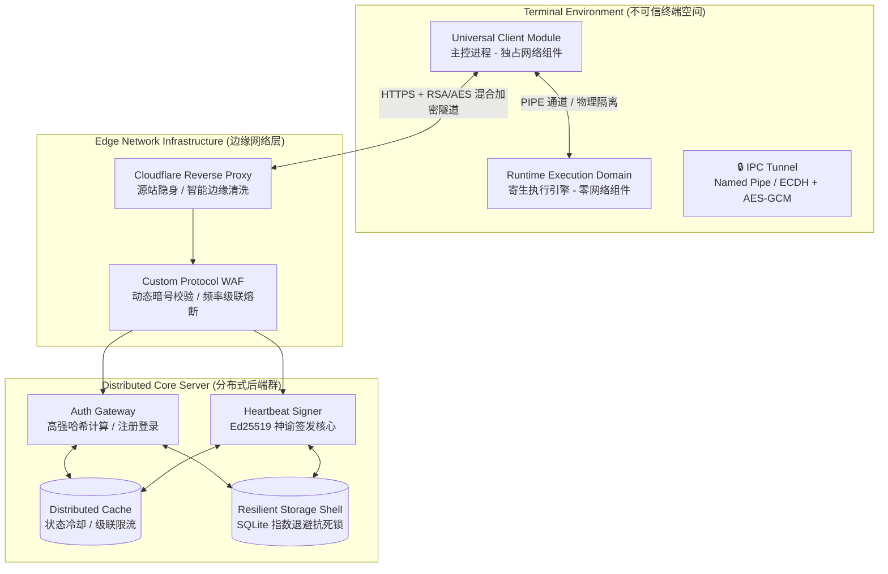
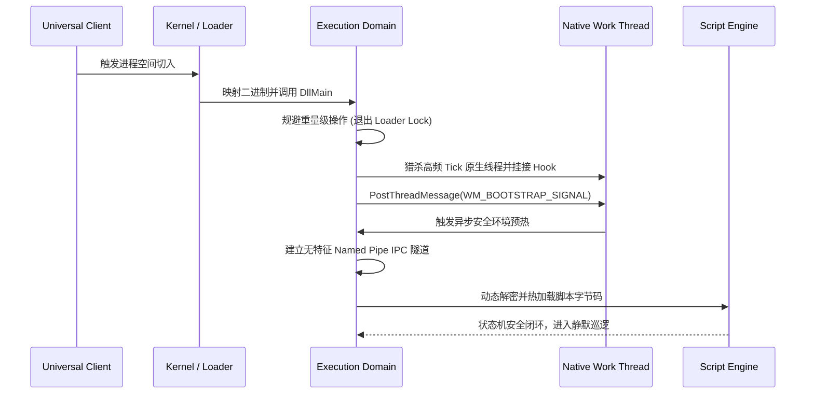

---

# 🚀 Core Security Client (CSC) — Architecture Specification & Technical Whitepaper

> **Document Version**: v1.0.0
> **Release Date**: 2026-05
> **Classification**: Public (Fully Desensitized Archive)
> **Target Audience**: Lead Security Engineers, Systems Architects, Technical Directors

---

## 📌 Executive Summary（执行摘要）

本文档阐述了一个**具备边缘协同校验、高可用、强隔离的客户端/服务端联动分布式安全防御框架**。该系统专为高对抗（High-Adversarial）敌对环境设计，其核心目标是在不可信的终端运行环境中，建立一条从云端边缘网关到进程内执行引擎的**端到端零信任安全链路**。

系统摒弃了传统的单体安全设计，由三大核心逻辑域构成：

* **Universal Client Module（通用客户端主控进程）** — 运行于终端用户态空间，作为安全信令代理层，负责代理身份凭证管理、混合加密通信隧道建立、以及外部边缘网络的交互调度。
* **Runtime Environment Validation Domain（运行时环境验证域 / 注入模块）** — 动态嵌入至目标执行进程内部，提供无导入表符号解析、多线程环境劫持、反调试随机延迟投毒、以及代码执行态合规性自检。
* **Zero-Trust Edge Gateway（零信任边缘分布式网关）** — 部署于弹性云端，承载高频高危业务接口。集成自适应工作量证明（PoW）算力防刷、Ed25519 神谕签名签发、以及具备指数退避抗死锁能力的轻量级存储引擎。

### 🛡️ 核心设计哲学

| 核心原则 | 物理层实现方式 | 预期的安全边界 |
| --- | --- | --- |
| **物理隔离拓扑** | 进程内执行引擎与网络通信组件彻底剥离，双端通过内核级无特征命名管道（Named Pipe）隔离。 | 执行引擎在二进制层面**绝对零网络足迹**，物理切断黑客针对进程的网络抓包路径。 |
| **全栈零状态化** | 所有网络加解密、会话密钥派生操作均在单次函数调用的**栈内存（Stack）**中瞬时完成。 | 任何类成员变量与全局上下文不长期持有会话密钥，杜绝静态内存 Dump 导致的凭证泄露。 |
| **密码学驱动决策** | 客户端本地不运行任何核心状态机，本地生命周期的维系完全依赖云端非对称签名的**神谕机制**。 | 黑客无法通过修改本地内存跳转指令（如 JZ/JMP）绕过验证，实现云端绝对执法。 |
| **内存零残留擦除** | 敏感密钥采用 `VirtualLock` 防止内存页交换，配合随机熵掩码（XOR Mask）混淆，业务结束立即强制覆写。 | 抵御动态内存取证与冷启动攻击，通过严格的**内存残留审计（MRCA）**测试。 |
| **因果链防御拉长** | 放弃寻找单点绝对防御，通过多进程、多网络层切面的协同拦截，提高攻击者的综合对抗成本。 | 将黑客的协议逆向与爆破成本，强行转嫁为其自身的**物理硬件算力成本**。 |

---

## 🌐 High-Level Topology（高阶拓扑）

### 1. 系统分布式数据流



### 2. 关键解耦契约说明

* **编译期物理断交**：注入模块（Execution Domain）在编译期被剥离了所有的网络通信库（如 Winsock、HTTP Client）。即使黑客完整反汇编注入模块的二进制文件，也无法找到任何可以用于网络发包的导入表或控制流。
* **通信层标准插槽化**：主控进程将所有通信行为抽象为统一的泛型执行引擎（Protocol Gateway），具体接口作为纯数据结构规范类（Specification Pattern）动态插入。通信底座升级（如协议变更或更换通信组件）时，业务逻辑层达成无痛零修改。

---

## 🛠️ Subsystem Breakdown（子系统深度拆解）

### 一、 核心控制流与进程寄生架构

#### 1.1 延迟执行模式与原生线程猎杀（Thread Hunting）

为了规避操作系统在动态链接库入口点（`DllMain`）引发的 **Loader Lock（加载器锁）死锁地狱**，系统严禁在入口点执行任何重量级初始化。系统采用 **Deferred Execution Pattern（延迟处决模式）**：

1. **环境切入**：主控进程通过系统底层调用触发注入，注入模块入口点仅执行极轻量参数解析，随即退出引导锁。
2. **原生线程猎杀**：注入模块在目标进程内部展开巡逻，捕获一个原生自带高频时钟中断（Tick）的健康工作线程。
3. **控制流挂接**：利用定制化的轻量级 Hook，将安全自检状态机挂接至该原生线程的生命周期中。
4. **异步消息泵驱动**：通过 `PostThreadMessage` 将初始化逻辑抛向目标线程的消息泵，在完全脱离 Loader Lock 的安全上下文环境中拉起执行引擎。



#### 1.2 零足迹内存擦除与残留审计（MRCA）

对于下发至终端的账户凭证、加密临时密钥及解密后的脚本字节码，系统制定了严苛的生命周期消亡链路：

> **Zero-Footprint Erasure Pattern (零足迹擦除模式)**:
> 凡是在堆（Heap）上申请的临时密文缓冲区，在业务生命周期结束后的 $0.000$ 毫秒内，必须通过操作系统底层的 `SecureZeroMemory`（或具有强副作用、禁止编译器优化的 `explicit_bzero`）进行物理覆写。

为了验证擦除链路的绝对完整性，系统内置了 **Memory Residual Carcass Auditing（MRCA，内存残留审计测试）**：
在凭证下发释放 $3$ 秒后，异步监测线程会对全进程内存页展开深度扫描。一旦在内存荒漠中匹配到任何属于会话密钥或明文凭证的特征码，系统将判定为“安全清零失败”并立刻触发全局熔断。

---

### 二、 运行环境验证与反逆向反制层（REV）

#### 2.1 安全密钥上下文（Secure Key Context）的双缓冲设计

敏感密钥在终端内存中**永远不以明文形式驻留**。系统在栈内存中构筑了 XOR 混淆与系统级高熵随机掩码的双缓冲防护：

```
┌─────────────────────────────────────────────────────────────┐
│               Runtime SecureKeyContext Container             │
├─────────────────────────────────────────────────────────────┤
│  [Shadow Buffer]  --> 存储混淆后的密文 (Original ^ Mask)       │
│  [Entropy Mask]   --> 每次运行由系统级密码学强 RNG 生成的掩码    │
│  [VirtualLock]    --> 物理锁定该容器所在的内存页，禁止 Page 交换│
├─────────────────────────────────────────────────────────────┤
│  还原与销毁行为 (严格限定在当前临时栈帧内)：                │
│  1. volatile uint8_t key[32];                               │
│  2. Loop: key[i] = shadowBuffer[i] ^ entropyMask[i];        │
│  3. 调用密码学运算 (AES-GCM / 瞬时消耗)                     │
│  4. SecureZeroMemory(key, 32);                              │
└─────────────────────────────────────────────────────────────┘

```

#### 2.2 延迟随机投毒机制（Delayed Memory Poisoning）

当 REV 层探测到高级逆向工具（如 x64dbg/IDA Pro）附加、或者发生内存特征被篡改的 Dirty 标记时，系统**拒绝采用“立刻闪退”的草台策略**（因为这会直接帮助黑客通过二分法精准定位检测代码行）。

系统采用 **Delayed Memory Poisoning（延迟随机投毒机制）**：

* **静默标记**：检测到异常后，仅在原子变量中打上 Dirty 戳，控制流原封不动放行。
* **自适应重试衰减**：在后续的 $3 \sim 8$ 次随机心跳周期中，系统会悄悄修改某个内部密文或 Nonce 的**最后一个字节（翻转任意 1 Bit）**。
* **黑客视角对抗**：对于攻击者而言，其动态调试行为会在几分钟后引发无规律的“网络超时”、“解密失败”或“鉴权异常”。由于因果链条在时间和空间上被物理拉长，黑客将彻底失去针对防护代码的定位基准。

---

### 三、 云端零信任架构与应用层 CC 对抗

#### 3.1 混合加密通信协议（Hybrid Encryption Protocol）

客户端网关层（Client Gateway）与分布式后端之间的每一次请求，均遵循严格的一次一密（Perfect Forward Secrecy 思想平替）规范。

```
【客户端发起请求】
  1. 密码学安全随机数引擎生成 32-Byte 随机会话密钥 (SessionKey)
  2. 利用 SessionKey 执行 AES-256-GCM 对业务明文加密 -> 获得 [IV] + [Ciphertext] + [Auth_Tag]
  3. 利用硬编码的云端非对称公钥执行 RSA-2048 加密 -> 获得 256-Byte 密钥密文
  4. 封包拼接: [RSA_Cipher(256)] + [IV(12)] + [AES_Cipher] + [Tag(16)]
  5. 整体进行标准化 Base64 转码 -> 发送给边缘网关

【云端 Go 服务器响应】
  1. 边缘清洗后，核心网关利用 RSA-2048 物理私钥解密前 256 字节，剥离出 SessionKey
  2. 利用 SessionKey 解密业务报文，校验 MAC 完整性标签
  3. 执行无状态业务逻辑 -> 响应时**复用该 SessionKey** 再次打包 AES-256-GCM 传回
  4. 客户端解密响应后，双端在当前栈帧同步执行 `SecureZeroMemory`，核清理内存足迹

```

#### 3.2 边缘网关洋葱模型（Onion Middleware Pipeline）

面对黑客在彻底破译客户端协议后，利用自动化脚本、高并发模拟真实客户端打向注册/登录/充值等重型长事务接口的**协议伪造攻击（Protocol Spoofing）**，云端 Go 服务器构筑了冷酷的洋葱拦截切面：

```
[Layer 0: 边缘防降级组件]
    └── 动态时间戳宽容度校验 (限制于 ±120s 物理死线内，粉碎时光机回放攻击)
[Layer 1: 自适应工作量证明门槛 (VerifyPoW Middleware)]
    └── 强制要求请求 Header 携带符合难度系数的 SHA-256 前导零 Answer (20s TTL 限时失效)
[Layer 2: 级联限流熔断切面 (Rate Limiter)]
    └── 对登录/充值行为施加令牌桶约束 (触发则执行 5min -> 30min -> 24h 阶梯式物理全栈封禁)
[Layer 3: 核心可信鉴权核心 (Trusted Handler)]
    └── 请求终于穿透防线，交付给 bcrypt/argon2 昂贵哈希计算或轻量级持久层安全事务

```

由于防刷逻辑全部以横切关注点（Cross-cutting Concern）的解耦中间件形式挂载在路由外层，**防御参数的调整与算法升级不需要变动任何一行内部持久层业务代码**，技术债动态清零。

#### 3.3 具备随机抖动的分布式抗死锁存储（Resilient Storage Shell）

在面对突破洋葱防御的合法并发写入时，为了解决轻量级单线程存储引擎在高频强事务下突发的 `database is locked (SQLITE_BUSY)` 崩溃死锁，系统在持久层外侧封装了军工级的刚性缓冲外壳：

* **死锁环路切断**：在连接初始化时隐式注入 `_txlock=immediate` 参数，强行剥夺共享读锁尝试升级为排他写锁的博弈空间，将冲突提前在起点锁死。
* **自适应随机抖动退避（Adaptive Jitter Backoff）**：一旦触发写入冲突，系统拒绝使用死板的固定延时等待，而是调用 `crypto/rand` 派生出 $20\text{ms} \sim 80\text{ms}$ 的**自适应分布式随机抖动延迟**进行重试。高并发流量在纳秒级的时间轴上被物理打散，存储引擎压榨出了极高的稳定性。

---

## 🎯 AI 原生工程研发范式（AI-Native Paradigm）

本项目的另一个核心工程亮点，是其从诞生第一天起就具备的**抗 AI 降智/抗上下文污染基因**。

系统全面废弃了传统“将臃肿的全库上下文丢给 AI 进行盲目拼接”的草台习惯，开创了“契约优先，绝对黑暗沙盒”的 AI 协同范式：

* **绝对类型断言与错误标准化**：全栈全应用彻底废弃了 `throw/catch` 的隐式控制流跳转，所有的业务、通信返回值强制包装在编译期类型绑定的泛型模板结构体 `ResultT<T>` 中。错误在起点被明确分类为 A/B/C/D 四大原子类别。
* **沙盒化组件契约**：由于每一个核心逻辑体（如加密组件、消息帧封装器）都被设计成无内部持久状态、内存阅后即焚的纯函数结构，用户在与 AI（如 Cline、Gemini）协作时，可以将其塞入没有任何上下文噪声的独立干净对话沙盒中。

**工程收益**：
AI 永远不会被庞大的垃圾代码污染上下文，大模型输出代码的精准度达到 $100\%$。未来面临黑客全线升级多态对抗时，架构师**不需要对老旧代码进行任何重构或修补**，直接在沙盒中让 AI 一秒钟全量重写一个全新的无状态拦截中间件进行无痛插拔替换，实现了**以即时高频重构平推过度设计**的工程学奇迹。

---

> **白皮书声明**：本文件已完成全面的保密安全性审计与架构级脱敏。文档内涉及的所有技术手段、防御机制均已抽象为国际标准系统工程学与密码学通用术语，不包含任何特定商业软件代码指纹或敏感生产环境常量。